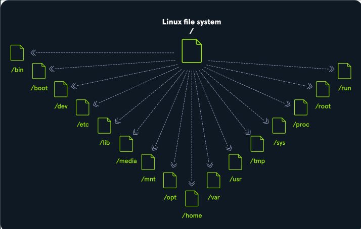

# Linux Structure
Linux is an operating system used for personal computers, servers, and even mobile devices. However, Linux stands as a fundamental pillar in cybersecurity, renowned for its robustness, flexibility, and open-source nature. It just like Windows, macOs, IOS, or Android. 

# Objective: 
In this topic we are going to cover the Linux structure, history, philosophy, architecture, and file system hierarchy—essential knowledge for any cybersecurity professional.

## History
Origins:
* Unix created in 1970 by Ken Thompson and Dennis Ritchie at AT&T.
* BSD (Berkeley Software Distribution) released in 1977, but legal issues with AT&T limited its development.
* Richard Stallman started the GNU Project in 1983 to create a free Unix-like OS. He also introduced the GNU General Public License (GPL).

Linux Kernel:
* Created in 1991 by Linus Torvalds, a Finnish student.
* Aimed to build a free, open-source OS kernel.
* Evolved from a small project to over 23 million lines of code, licensed under GPL v2.

Distributions (Distros):
* Over 600 Linux distributions exist.
* Popular ones include: Ubuntu, Debian, Fedora, OpenSUSE, elementary, Manjaro, Gentoo, RedHat, Linux Mint.
* Each distro includes the Linux kernel + supporting software and libraries.

Security and Stability:
* Linux is considered more secure and stable than many other OSs.
* Less vulnerable to malware than Windows.
* Frequent updates and high performance, but may be harder for beginners.
* Fewer hardware drivers compared to Windows.

Usage and Licensing:
* Free and open-source – anyone can modify and redistribute.
* Used in servers, desktops, mainframes, embedded systems (e.g., routers, TVs, game consoles).
* Android OS is based on the Linux kernel, making it the most widely installed OS globally.

Operating System Basics:
* Linux is an OS like Windows or macOS – it manages hardware-software communication.
* A distribution is similar to a “version” of an OS.

Working Environment:
* Training uses Pwnbox, a custom version of Parrot OS (Debian-based).
* Parrot OS focuses on security, privacy, and development.

Linux as a Company Analogy:
* Components = employees with roles.
* Architecture = organizational structure.
* Philosophy = company culture promoting simplicity, cooperation, and transparency.

## Philosophy
The Linux philosophy centers on simplicity, nodularity, and openness. It advocates for building small, single-purpose programs that perform one task well.
It follows five core principles: 

| Principle                                 | Description                                                                                                               |
|-------------------------------------------|---------------------------------------------------------------------------------------------------------------------------|
| Everything is a file                      | All configuration files for the various services running on the Linux operating system are stored in one or more text files. |
| Small, single-purpose programs            | Linux offers many different tools that we will work with, which can be combined to work together.                        |
| Ability to chain programs together to perform complex tasks | The integration and combination of different tools enable us to carry out many large and complex tasks, such as processing or filtering specific data results. |
| Avoid captive user interfaces             | Linux is designed to work mainly with the shell (or terminal), which gives the user greater control over the operating system. |
| Configuration data stored in a text file  | An example of such a file is the /etc/passwd file, which stores all users registered on the system.                      |

## Components
| Component       | Description |
|----------------|-------------|
| Bootloader      | A piece of code that runs to guide the booting process to start the operating system. Parrot Linux uses the GRUB Bootloader. |
| OS Kernel       | The kernel is the main component of an operating system. It manages the resources for system's I/O devices at the hardware level. |
| Daemons         | Background services are called "daemons" in Linux. Their purpose is to ensure that key functions such as scheduling, printing, and multimedia are working correctly. These small programs load after we boot or log into the computer. |
| OS Shell        | The operating system shell or the command language interpreter (also known as the command line) is the interface between the OS and the user. This interface allows the user to tell the OS what to do. The most commonly used shells are Bash, Tcsh/Csh, Ksh, Zsh, and Fish. |
| Graphics Server | This provides a graphical sub-system (server) called "X" or "X-server" that allows graphical programs to run locally or remotely on the X-windowing system. |
| Window Manager  | Also known as a graphical user interface (GUI). There are many options, including GNOME, KDE, MATE, Unity, and Cinnamon. A desktop environment usually has several applications, including file and web browsers. These allow the user to access and manage the essential and frequently accessed features and services of an operating system. |
| Utilities       | Applications or utilities are programs that perform particular functions for the user or another program. |

## Linux Architecture
| Layer           | Description |
|----------------|-------------|
| Hardware        | Peripheral devices such as the system's RAM, hard drive, CPU, and others. |
| Kernel          | The core of the Linux operating system whose function is to virtualize and control common computer hardware resources like CPU, allocated memory, accessed data, and others. The kernel gives each process its own virtual resources and prevents/mitigates conflicts between different processes. |
| Shell           | A command-line interface (CLI), also known as a shell that a user can enter commands into to execute the kernel's functions. |
| System Utility  | Makes available to the user all of the operating system's functionality. |

## File System Hierarchy

| Path     | Description |
|----------|-------------|
| `/`      | The top-level directory is the root filesystem and contains all of the files required to boot the operating system before other filesystems are mounted, as well as the files required to boot the other filesystems. After boot, all of the other filesystems are mounted at standard mount points as subdirectories of the root. |
| `/bin`   | Contains essential command binaries. |
| `/boot`  | Consists of the static bootloader, kernel executable, and files required to boot the Linux OS. |
| `/dev`   | Contains device files to facilitate access to every hardware device attached to the system. |
| `/etc`   | Local system configuration files. Configuration files for installed applications may be saved here as well. |
| `/home`  | Each user on the system has a subdirectory here for storage. |
| `/lib`   | Shared library files that are required for system boot. |
| `/media` | External removable media devices such as USB drives are mounted here. |
| `/mnt`   | Temporary mount point for regular filesystems. |
| `/opt`   | Optional files such as third-party tools can be saved here. |
| `/root`  | The home directory for the root user. |
| `/sbin`  | This directory contains executables used for system administration (binary system files). |
| `/tmp`   | The operating system and many programs use this directory to store temporary files. This directory is generally cleared upon system boot and may be deleted at other times without any warning. |
| `/usr`   | Contains executables, libraries, man files, etc. |
| `/var`   | This directory contains variable data files such as log files, email in-boxes, web application related files, cron files, and more. |
