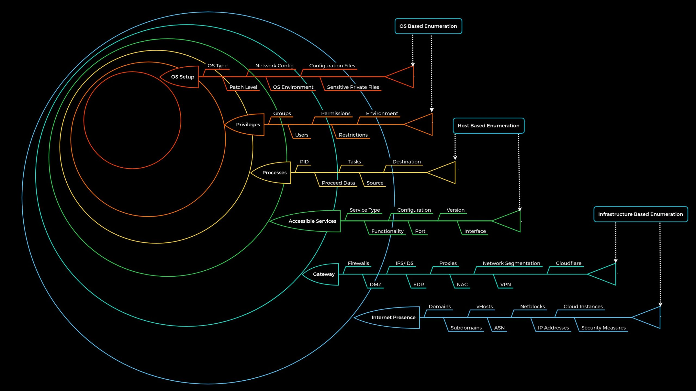

## Why Use a Methodology?

In cybersecurity, especially in penetration testing, dealing with complex environments requires a **structured approach**. Enumeration methodology provides a **standardized framework** to ensure no critical aspect is overlooked, despite the unpredictable nature of target systems.

### Common Mistake:
Most testers follow a **personal habit-based** or **experience-driven flow** rather than a structured methodology. While experience is valuable, **a formal methodology ensures consistency and completeness**.

---

## A Layered Enumeration Approach

This methodology is **static in structure but dynamic in application**. It’s composed of **6 layers**, designed to act like boundaries or barriers — each needing to be explored and potentially overcome to advance closer to the goal.

> Think of it as facing a series of walls. Instead of smashing through blindly, the goal is to look for doors, cracks, or ladders to pass through smartly.

There are **three levels** of enumeration:
- **Infrastructure-based Enumeration**
- **Host-based Enumeration**
- **OS-based Enumeration**

---

## Visualization of Enumeration Layers

### Note:
- The **first two layers (Internet Presence & Gateway)** don’t directly apply to internal environments like Active Directory.
- These layers will be discussed in detail in later modules.

---

## Overview of Enumeration Layers

| Layer | Description                                                                 | Information Categories                                                                 |
|-------|-----------------------------------------------------------------------------|----------------------------------------------------------------------------------------|
| 1     | **Internet Presence** – Identification of external footprint                | Domains, Subdomains, vHosts, ASN, Netblocks, IPs, Cloud Instances, Security Measures  |
| 2     | **Gateway** – Identification of protective measures                         | Firewalls, DMZ, IDS/IPS, EDR, Proxies, VPN, Cloudflare, Network Segmentation, NAC     |
| 3     | **Accessible Services** – Discover available services and interfaces        | Service Type, Functionality, Ports, Versions, Configuration, Interfaces               |
| 4     | **Processes** – Analyze internal data flow and process interactions         | PIDs, Tasks, Sources, Destinations, Data Handled                                      |
| 5     | **Privileges** – Identify permissions and privilege structures               | Groups, Users, Permissions, Restrictions, Execution Context                           |
| 6     | **OS Setup** – Analyze the operating system and environment configuration   | OS Type, Patch Level, Network Config, Sensitive Files, OS Environment                 |

---

## Metaphor: The Labyrinth

The enumeration process can be imagined like navigating a **labyrinth**. Each gap or wall represents a **challenge or potential vulnerability**.

Not all gaps lead deeper — some may be **dead ends**. Still, a skilled tester operates with the belief that there is **always a way in**. Real-world examples, like the **SolarWinds attack**, show that even the most secure environments can be breached with enough knowledge and time.

---

## Layer-by-Layer Breakdown

### 🔹 Layer 1: Internet Presence

- Objective: **Find all externally visible targets** (domains, subdomains, IPs).
- Especially important in **black-box** testing where only limited information is given.
- Techniques include WHOIS lookups, DNS enumeration, and search engine dorking.

### 🔹 Layer 2: Gateway

- Understand how the system is protected.
- What firewalls or proxies stand in front of our targets?
- Are we dealing with a VPN, a load balancer, or even a DDoS protection service?

> This layer is complex and will be explored in more depth in future modules.

### 🔹 Layer 3: Accessible Services

- Examine **available services** on discovered systems (e.g., HTTP, SSH, FTP).
- Identify version numbers, configurations, and endpoints.
- Understand the purpose of each service and how it can be manipulated.

> This layer is the **primary focus** of this module.

### 🔹 Layer 4: Processes

- Determine what processes are running, what tasks they perform, and what data they use.
- Look for misconfigured services, open pipes, and data flows between components.

### 🔹 Layer 5: Privileges

- Services often run under specific users or groups.
- Misconfigured permissions or over-privileged accounts often lead to escalation.
- Especially critical in environments like **Active Directory**.

### 🔹 Layer 6: OS Setup

- Once internal access is achieved, inspect the operating system’s configuration.
- Look for poor patch management, sensitive data exposure, or insecure files.
- Evaluate how well the systems are maintained and secured.

---

## Enumeration Methodology in Practice

A **methodology** is not a step-by-step checklist. Rather, it is a **collection of organized procedures** that guide your exploration toward the target.

> It is flexible.  
> It is adaptable.  
> It evolves with technology and tools.

### Important Clarification:
Tools like `nmap`, `dirsearch`, or `ffuf` are not part of the methodology — they are part of your **cheat sheet** or **toolkit**.  
The **methodology** is the strategy that tells you **what to do** and **when to do it** — tools help you do it faster or more efficiently.

---

## Key Takeaways

- Use a **layered approach** to structure your enumeration.
- **Don’t force your way through** — plan and identify the smartest entry point.
- Keep the methodology flexible to adapt to the environment.
- Focus on **understanding**, not just discovering.

---
