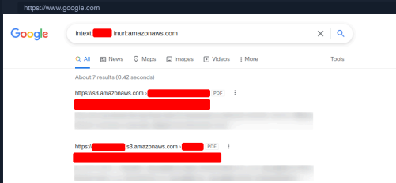
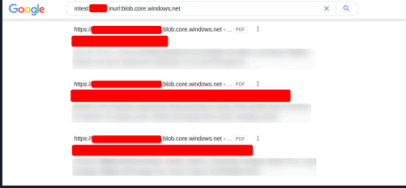
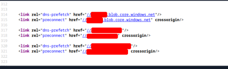
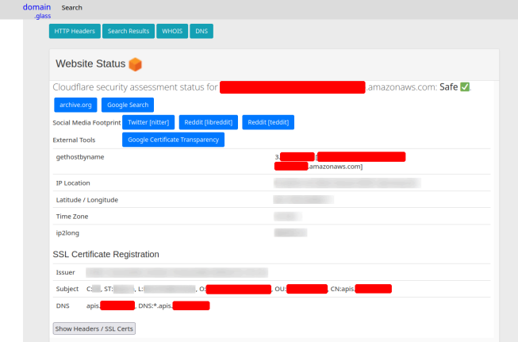
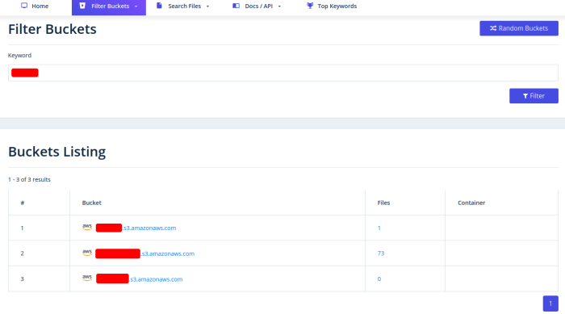

# Cloud Resources

The use of cloud platforms, such as **AWS**, **GCP**, **Azure**, and others, has become a fundamental part of many companies today. This is because businesses increasingly need the ability to work from anywhere, which requires a central point for managing all their resources. Services like **AWS** (Amazon), **GCP** (Google), and **Azure** (Microsoft) are ideal for this purpose.

While cloud providers secure their infrastructure centrally, companies are still vulnerable if their administrators configure cloud resources incorrectly. A common vulnerability occurs in services like **S3 buckets** (AWS), **blobs** (Azure), and **cloud storage** (GCP), which can be left accessible without authentication if not configured properly.

---

## Company Hosted Servers

You can use the following command to check the IP addresses associated with different subdomains. This is helpful to identify cloud-based services or company infrastructure:

```bash
K4y0x13@htb[/htb]$ for i in $(cat subdomainlist); do host $i | grep "has address" | grep inlanefreight; done

blog.inlanefreight.com 10.129.24.93
inlanefreight.com 10.129.27.33
matomo.inlanefreight.com 10.129.127.22
www.inlanefreight.com 10.129.127.33
s3-website-us-west-2.amazonaws.com 10.129.95.250
```

Often, cloud storage is added to the DNS list for administrative purposes, making it easier for employees to access and manage them. For instance, in the example above, the IP address s3-website-us-west-2.amazonaws.com belongs to an AWS S3 bucket.

There are many ways to discover such cloud resources. One of the easiest methods is using Google search combined with Google Dorks. Using operators like inurl: and intext:, you can narrow your search to specific terms, helping identify files or services related to a company.

## Google Search for AWS

Here, you may find results such as PDFs or other resources linked to AWS. When searching for a company, you could also come across other file types like text documents, presentations, and even source code.



## Google Search for Azure

Similarly, searching for resources hosted on Azure can reveal different types of files or services. Cloud storage misconfigurations can sometimes lead to the exposure of sensitive data.



## Target Website - Source Code

In many cases, cloud storage is referenced within the source code of web pages, including images, JavaScript, or CSS files. These files may be stored in the cloud to reduce load on the web server by not having to store unnecessary content locally.



## Third-Party Providers for Infrastructure Discovery

Third-party tools, such as domain.glass, can provide valuable information about a company's infrastructure. For example, it may reveal if a company is using Cloudflare for additional security measures, showing the status as "Safe." This is a useful finding that can be noted for further penetration testing.



## GrayHatWarfare Results

Another valuable resource is GrayHatWarfare, a provider that allows you to search for cloud storage across AWS, Azure, and GCP. It also provides options to filter results by file format. After discovering cloud storage through Google, you can use GrayHatWarfare to passively search for files stored on these platforms.



## Company Abbreviations in IT Infrastructure

Many companies use abbreviations of their names in their IT infrastructure. These abbreviations can be a useful clue when discovering new cloud storage associated with the company. Searching for files related to these abbreviations can help identify accessible files.

## Private and Public SSH Keys Leaked

When employees are under stress or pressure, errors can lead to significant security vulnerabilities. One such issue is the accidental leak of SSH private keys, which can allow anyone to download and use these keys to access company systems without a password.


## SSH Private Key

If an SSH private key is exposed, it could lead to unauthorized access to one or more company machines. This type of vulnerability is particularly dangerous because it grants direct access without requiring a password.

