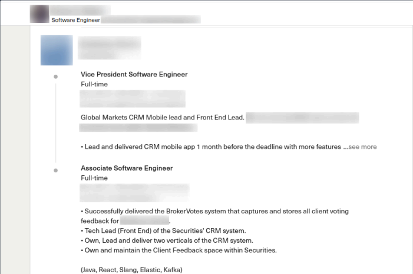

# Staff

Searching for and identifying employees on social media platforms can provide valuable insights into a company's infrastructure and operations. By looking at employees' online profiles, particularly on platforms like LinkedIn or Xing, we can gather information about the technologies they are using, the programming languages they are familiar with, and even the software applications they rely on. 

These profiles often reveal what projects employees are engaged in and what they believe is worth sharing. This type of information helps us understand the specific focus of each individual and, by extension, the company's technical landscape.

### LinkedIn - Job Post

Job postings are a great resource for identifying technologies and tools that companies use. For example, a job posting can tell us which programming languages are preferred for a position. In one example, programming languages like **Java**, **C#**, **C++**, **Python**, **Ruby**, **PHP**, and **Perl** were mentioned. Similarly, the job listing may specify that the candidate must be familiar with databases such as **PostgreSQL**, **MySQL**, and **Oracle**.

Additionally, we can gain insights into the frameworks used for web development, such as **Flask**, **Django**, **ASP.NET**, and **Spring**. The job post may also mention the use of **REST APIs**, **Github**, **SVN**, and **Perforce**. Furthermore, if the listing indicates the use of the **Atlassian Suite**, this suggests the company may be using tools like Jira, Confluence, and Bitbucket, which are often part of the infrastructure.

From a single job posting, we can gather a reasonable idea of the technologies and methodologies the company is working with. This information can be useful in penetration testing, as it may indicate potential targets or areas to investigate.

---

### LinkedIn - Employee #1 About

Social media sites, such as LinkedIn, allow individuals to showcase their skills, projects, and career history. By reviewing an employee’s profile, we can understand their expertise and what technologies they are familiar with. This provides a glimpse into the company's technical stack and the skillset of its workforce.

For instance, if an employee is skilled in **Flask** and **Django**, it can lead us to specific security configurations associated with these technologies. A simple search for **Django security misconfigurations** might reveal a **GitHub** repository containing important security information related to the **OWASP Top 10** for Django. These kinds of repositories provide insights into the common security pitfalls in Django applications and can highlight areas of vulnerability that need attention.

---

### GitHub

GitHub is another valuable platform for discovering company-related resources. Many employees share code and project repositories that can contain sensitive information, such as **hardcoded JWT tokens** or even personal email addresses. For example, when exploring an employee's shared project, we might come across a security vulnerability in the form of a hardcoded authentication token. These tokens can potentially allow unauthorized access to a company’s resources.

While sharing projects on GitHub can lead to networking and business opportunities, it also opens the door to potential security risks if employees are not careful about what they share.

---

### LinkedIn - Employee #2 Career

LinkedIn offers robust search functionality, which allows us to filter employees based on their connections, location, company, school, industry, profile language, services, names, titles, and more. The level of detail in an employee’s profile will affect how narrow or broad our search results are. 

When investigating a company's infrastructure, we should focus on technical employees working in **development** and **security** roles. These employees are likely to provide insights into the company’s security measures and the technologies in use. By analyzing their job descriptions and shared content, we can get a better understanding of how the company approaches security and what protections they have in place.

---

### Conclusion

Social media platforms like LinkedIn and GitHub, while excellent for networking, can also be a goldmine for passive information gathering during penetration testing. By examining job postings, employee profiles, and shared projects, we can discover crucial details about the technologies and security measures used by a company. It's important, however, to be cautious when sharing personal or sensitive information publicly, as these same details can be exploited by attackers to gain access to company resources.
