# Enumeration
## Nmap

I did the nmap scan for the service and versions. There are many open ports. 

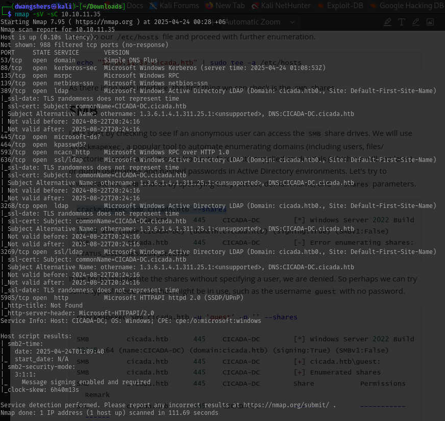

As there is no web interface, the first thing we can check is the SMB shares.

## SMB

First, let’s check if someone without login credentials (an anonymous user) can access the shared folders on the SMB server. We'll use a tool called crackmapexec, which is great for automating the process of gathering information about domains—like listing users, shared folders, and directories. This tool can also be used for brute-force attacks with login credentials (we’ll cover that later), and in Active Directory setups, it can even pull out usernames and password hashes. For now, we’ll focus on scanning the SMB shares by providing the protocol, domain name, and using the --shares option.

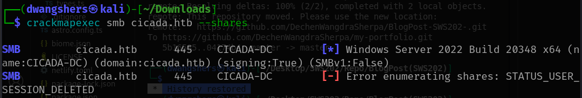

If we try to enumerate the shares without specifying a user, we are denied. So perhaps we can try
some typical credentials that might be in use, such as the username guest with no password.

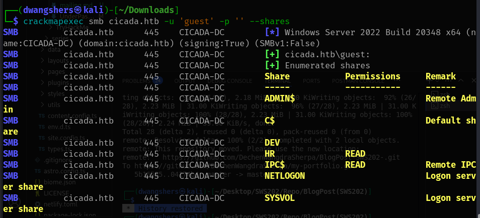

Looks like we were able to access the HR share as a guest user—meaning no login credentials were needed. Now, we’ll use a tool called smbclient to connect to that share and look at the files stored inside it.

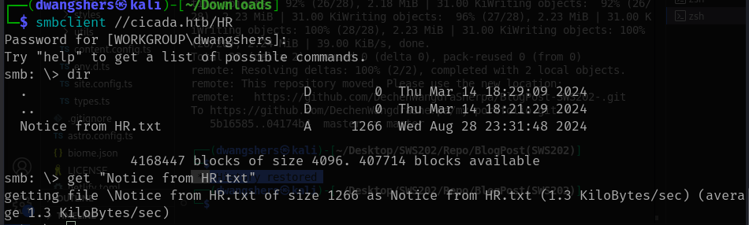

Using the dir command to list the contents, we see the file Notice from HR.txt, and we can
download it to our machine with the get command. Viewing the file reveals a default password!

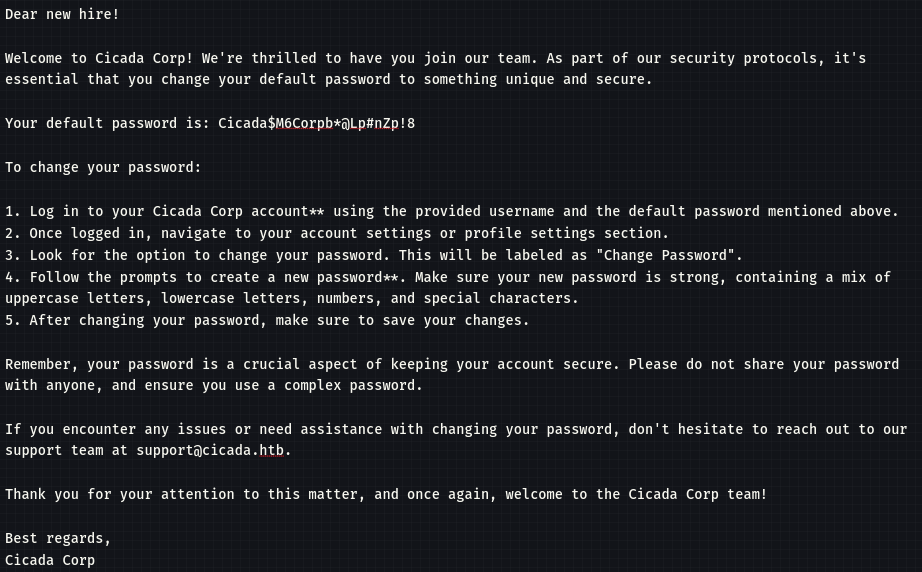

## Lookupsid

Now that we’ve discovered a password, we can check if any domain accounts are still using it. To do that, we first need to find out which users exist in the domain.

We can use a tool from Impacket called lookupsid, which works by brute-forcing Security Identifiers (SIDs). Each user in an Active Directory (AD) domain has a unique SID, which includes their user ID (RID) combined with the domain’s SID. These SIDs are assigned by the Domain Controller and are used to control access and permissions.

To get a list of domain users, we’ll run lookupsid using:

- The guest account
- The domain name
- The -no-pass option (since we’re not using a password)

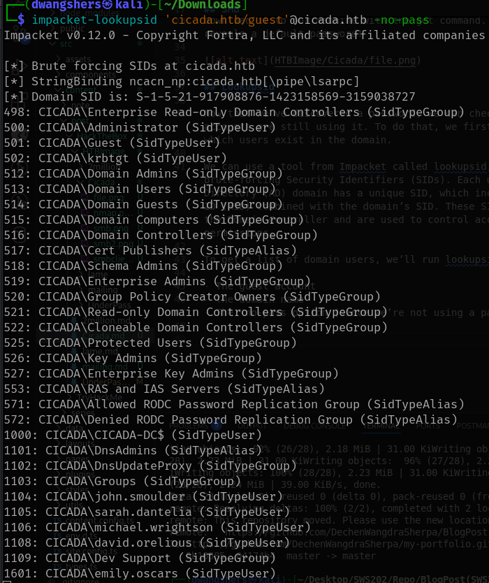

The results from the lookupsid scan include a mix of groups, users, and aliases within the domain, which gives us a better idea of how the domain is set up. Since we're specifically interested in getting a list of users, we’ll focus on entries labeled as SidTypeUser.

Rather than sorting through everything by hand, we can run the command again with some extra tools:

- Use grep to filter out only the user entries.
- Use sed to clean up the output and leave just the usernames.
- Finally, we’ll save those usernames into a file called users.txt for later use.

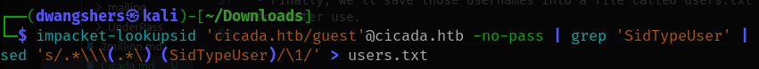

So, lets see inside the users.txt file.

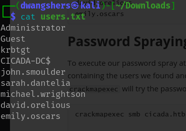

## Password Spraying

To carry out our password spray attack, we’ll use crackmapexec again. This time, we’ll give it the file with all the usernames we collected and the default password we found: Cicada$M6Corpb*@Lp#nZp!8.

crackmapexec will go through the list and try that password on each user, checking if any of them are using it.

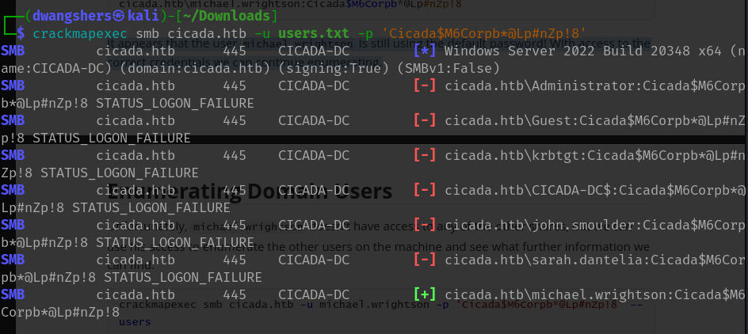

It appears that the user **michael.wrightson** is still using the default password! With access to the correct credentials we can continue enumerating.

## Enumerating Domain Users

Unfortunately, michael.wrightson doesn't have access to any of the other shares, but we can use his access to enumerate the other users on the machine and see what further information we can find.

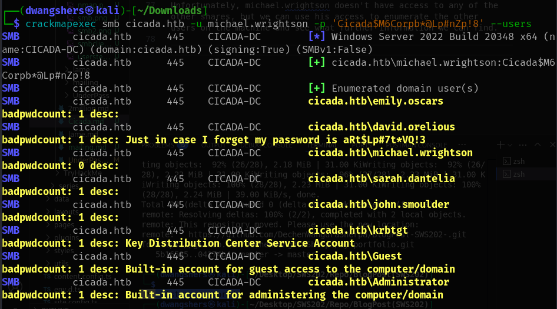

It turns out that the user david.orelious has saved their password (aRt$Lp#7t*VQ!3) in their Active Directory description field—probably so they don’t forget it. While this isn’t a secure practice, it’s something you still see in real-world environments where convenience often wins over security. Luckily for us, this kind of slip-up can be used to help escalate our privileges.

## Foothold

With david.orelious 's credentials, we can check what shares he has access to.

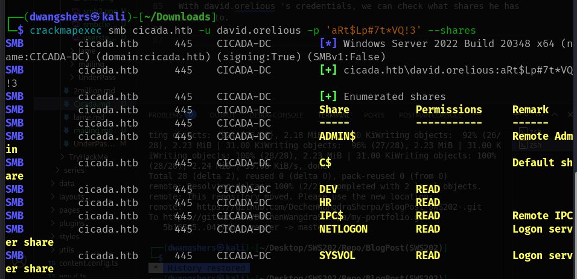

It seems we have access to the DEV share, let's see if there is anything useful there. Using
smbclient once more and specifying David 's credentials, we find an interesting file! Let's
download it to our machine and see what it contains.

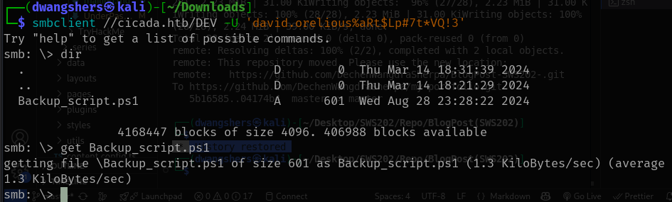

The PowerShell script is used to create a zip backup of the C:\smb folder and stores it in the D:\Backup directory with a timestamp in the filename. After the backup is made, it lets the user know that it's done and where the file was saved.

But what really stands out to us is that the script also contains another set of exposed plaintext credentials—this time for the user emily.oscars, with the password Q!3@Lp#M6b*7t*Vt. These credentials could be very useful for further access or privilege escalation.

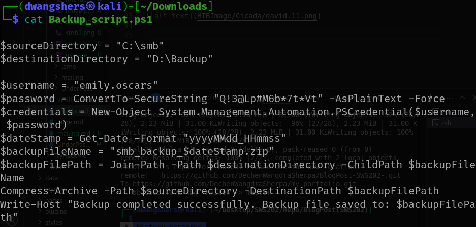

Since we have new credentials, we can try to use them to get a shell on the machine. Let's use
Evil-WinRM and see if the credentials we found work.

We've successfully gotten a WinRM session as Emily and can navigate to her desktop under
C:\Users\emily.oscars.CICADA\Desktop to find the user flag!

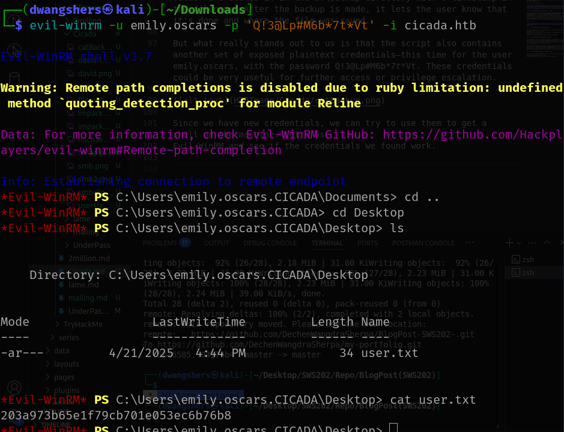

## Privilege Escalation

Lets escalate to privileges,

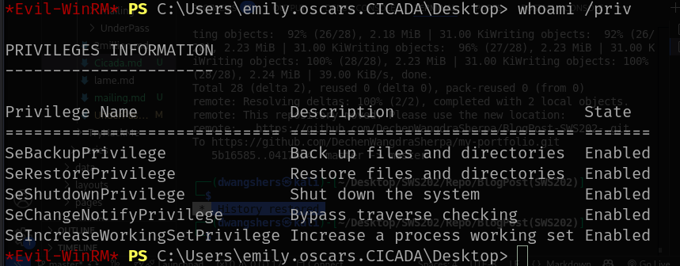

Emily has the SeBackupPrivilege, a permission usually granted to service accounts or administrators. This privilege is meant for backing up the system, and it allows users to access protected files and bypass other restrictions. In a real-world scenario, giving a regular user this privilege is risky because it gives them access to sensitive files, like the SYSTEM and SAM Windows Registry hives. These hives hold the information we need to escalate our privileges.

Here’s why this matters:

- The SAM (Security Account Manager) hive stores local user account data and hashed passwords.

- The SYSTEM hive contains system settings, including the boot key, which is necessary to decrypt the password hashes stored in the SAM.

By using the reg save command, we can export these hives (SAM and SYSTEM) into files. We can then use the NTLM hashes to authenticate as the Administrator without needing the plaintext password.

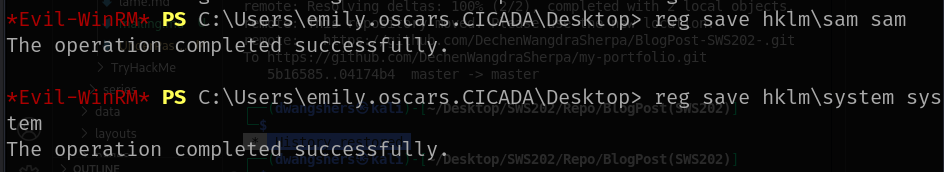

Now, we can download the two files to our system simply by using Evil-WinRM 's download
command.

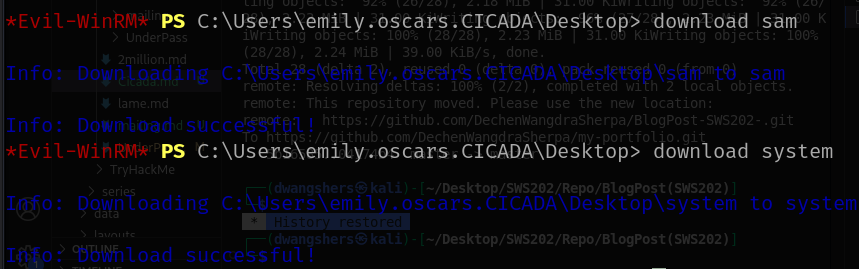

Now that we have the SAM and SYSTEM files on our local machine, we can use Impacket’s secretsdump module to extract the NTLM hashes of user passwords. The NTLM hash is a cryptographic representation of the user's password, meaning it’s a secure form of the plaintext password.

Once we retrieve the hashes, we have two options:
- Crack the hash to reveal the plaintext password.

- Use Pass-the-Hash to authenticate directly to the system without needing the actual password.

To extract the hashes, we need to provide the following arguments:

- -sam: The path to the SAM file, which holds the encrypted password data.

- -system: The path to the SYSTEM file, which contains the boot key used to decrypt the SAM file.

- local: This indicates the files are local and not being accessed over the network.

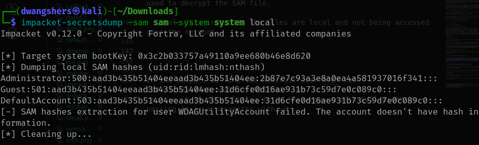

In the output, we find the Administrator NTLM hash 2b87e7c93a3e8a0ea4a581937016f341 . We
can use it to directly log in to the account with Evil-WinRM by passing it as a parameter with -H .

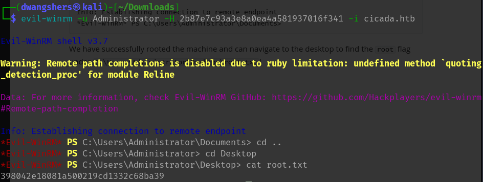

We have successfully rooted the machine and can navigate to the desktop to find the root flag under **C:\Users\Administrator\Desktop\root.txt**

# Learnings

* Credential Discovery – Find default/plaintext passwords in shared files.

* User Enumeration – Use lookupsid to list domain users.

* Password Spraying – Identify weak/reused passwords with crackmapexec.

* Sensitive Metadata – AD description field can leak credentials.

* Remote Shell – Use Evil-WinRM to access system with valid creds.

* Privilege Escalation – Abuse SeBackupPrivilege to access protected files.

* Registry Hive Dumping – Save SAM and SYSTEM hives using reg save.

* Hash Dumping – Use secretsdump.py to extract NTLM password hashes.

* Pass-the-Hash – Authenticate as Administrator using NTLM hash.

# Reference

Pho3. (2025, January 17). Cicada walkthrough (Document No. D25.100.319).
(Machine author: theblxckcicada; Classification: Official; Difficulty: Easy)
