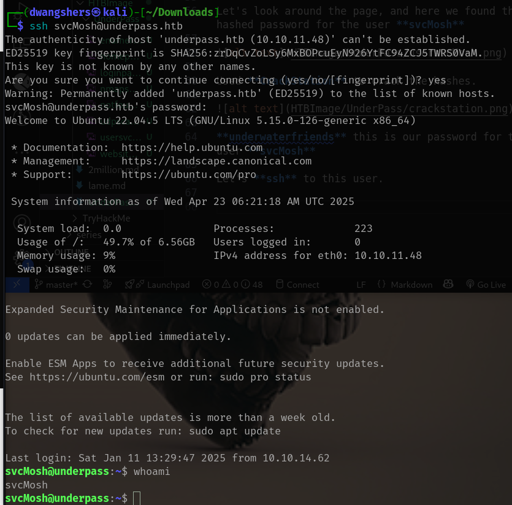

# Enumeration
Nmap Scans

So, from the nmap scan for service and version scan, there are two ports open **22 SSH**, **80 HTTP**

Let's see what's there in the website. 

Seems, nothing interesting. 

Let's do a UDP scan in the target machine.

We found that 161 SNMP port is open.

Let’s try to enumerate SNMP protocol using snmpwalk tool

Found an email for the user steve ends with underpass.htb. We also notice that **daloradius** server is running which is simply an advanced RADIUS web management application that shares access to the backend database.

Try to get to the daloradius server page, but we got 403 Forbidden

From the daloradius docs on Github we found a login page on this path **daloradius/app/users/login.php**

Found another login page under the path **/daloradius/app/operators/login.php**

Tried Default credentials, which is mostly, 

username: administrator
password: radius

We got in.

Let's look around the page, and here we found this hashed password for the user **svcMosh**

Used **CrackStation** to crack the hashes. 

**underwaterfriends** this is our password for the user **svcMosh**

Let's **ssh** to this user. 

Let’s cat out the user flag

# Privilege Escalation

Do sudo -l to see if we can run any binary as root

We can run /usr/bin/mosh-server with sudo

The server is giving us two things **port 60001** and a key **i+r956uKBWw3I3fWC3zuAQ**
 
Found in the **/usr/bin** path another binary called mosh-client it seems that it’s used to connect to the server,
If we try to connect to the localhost on the port given it’ll tellus that

So, lets make an environment variable with the key using **export**

We got the root access.

Lets cat out the root flag.

# Learnings

- SNMP Enumeration: Used snmpwalk to find users and services like DaloRADIUS.

- Web Recon: Discovered hidden login paths via GitHub docs.

- Default Credentials: Logged in using common default creds (administrator : radius).

- Hash Cracking: Cracked user password from a hash using CrackStation.

- Initial Access: SSH access using cracked credentials.

- Privilege Escalation: Escalated to root using sudo mosh-server and environment variables.

# Reference

CyGeek. (n.d.). UnderPass Walkthrough - HackTheBox. Medium. https://medium.com/@CyGeek/underpass-walkthrough-hackthebox-a7f038767a19

### Tools Used
- nmap 
- snmpwalk
- browser
- CrackStation
- ssh
- mosh-server/mosh-client