<p align="center">
  
</p>

# Enumeration
## Nmap Scan

I started by running a basic Nmap scan to enumerate open ports and services on the target machine (`10.10.10.3`):

``nmap -sC -sV 10.10.10.3``

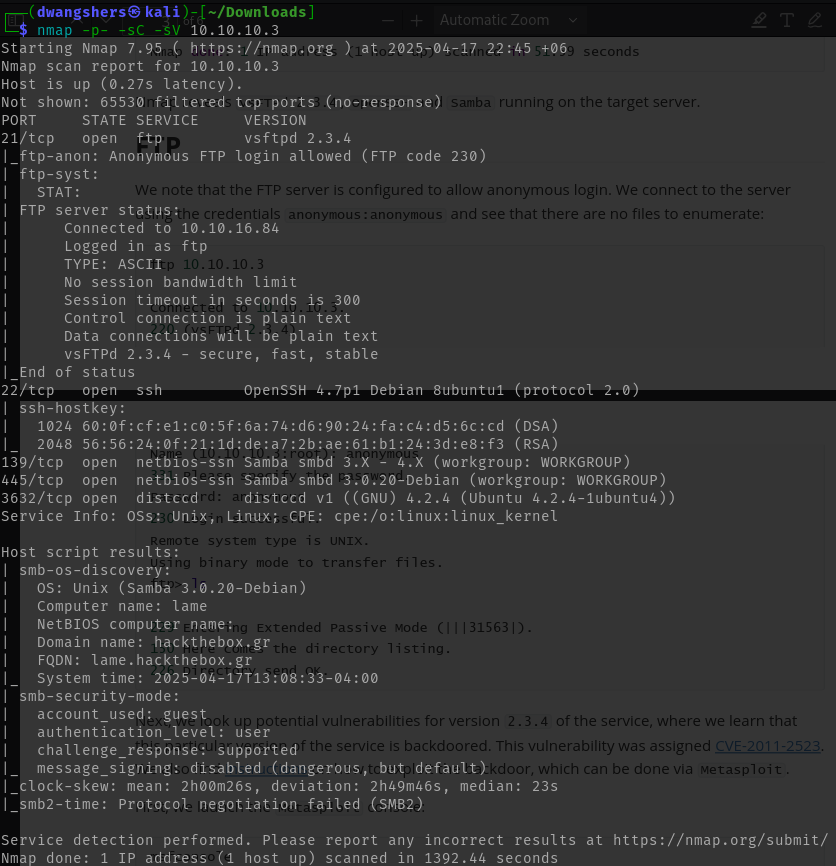

From the Nmap scan results, I found that FTP (port 21) is open and allows anonymous login, which means I can connect without any credentials and possibly access or download files. Samba services are running on ports 139 and 445, and the version detected is quite old (Samba 3.0.20), which may be vulnerable to known exploits such as CVE-2007-2447. SSH (port 22) is also open, providing a way to remotely access the machine, although it requires valid login credentials to use.

# FTP
From the nmap scan it was clear that, the FTP server is configured to allow anonymous login.

Did connected the server using the ``credentials anonymous:anonymous`` and found that there are no files to enumerate.

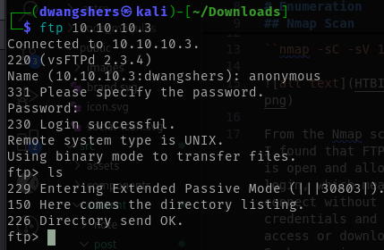

Next, we look up potential vulnerabilities for version 2.3.4 of the service, where we learn that this particular version of the service is backdoored.

This vulnerability was assigned [CVE-2011-2523](https://nvd.nist.gov/vuln/detail/CVE-2011-2523). We also find [instructions](https://www.rapid7.com/db/modules/exploit/unix/ftp/vsftpd_234_backdoor/) on how to exploit the backdoor, which can be done via Metasploit .

Let's launch Metasploit: 

`msfconsole`

Then I searched: ``search vsftpd``

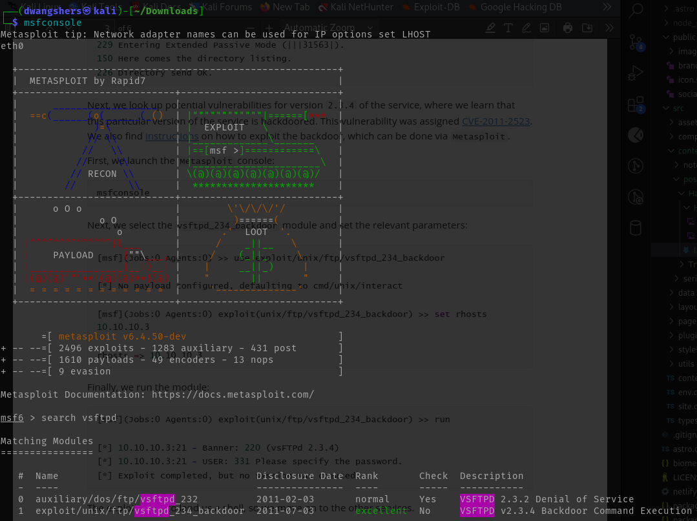

As we see that it as the hash 1: ``use 1``
Set RHOSTS to Ip: ``set RHOSTS 10.10.10.3``

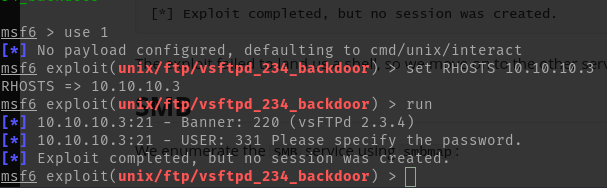

Finally, we run the module.
The exploit failed to land us to a shell, so lets move on to the other services.

# SMB

To enumerate the SMB service, lets use ``smbmap``:

``smbmap``: SMBMap allows users to enumerate samba share drives across an entire domain. List share drives, drive permissions, share contents, upload/download functionality, file name auto-download pattern matching, and even execute remote commands. 

The command I am using is ``smbmap -H 10.10.10.3``:

What this command mean in simple term, from chatGTP.

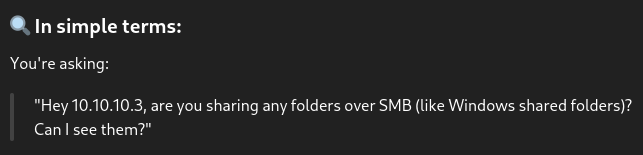

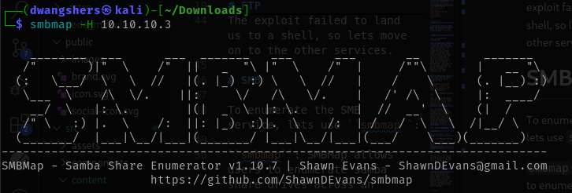

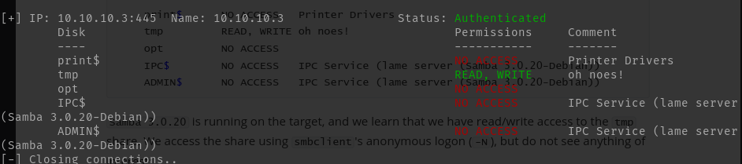

### Why is tmp important?

Because:

    You can upload files (like reverse shells, malicious scripts).

    You can read existing files (might find sensitive info).

This share could help you escalate access or execute code remotely, depending on what's running on the server.

Lets try to interact with the `tmp` share using ``smbclient //10.10.10.3/tmp -N``

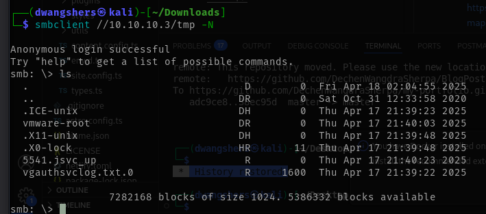

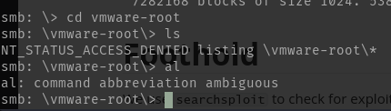

There seems nothing interesting.


Now, lets try using ``searchsploit`` to check for exploits for the samba service on the target:

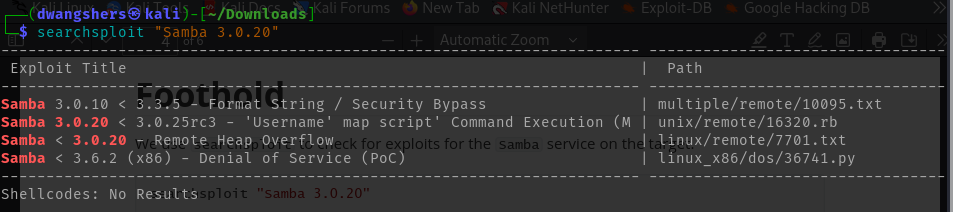

We see one interesting entry, namely a Remote Command Execution (RCE) vulnerability that can
be exploited using Metasploit.

```
Samba 3.0.20 < 3.0.25rc3 - 'Username' map script' Command Execution (Metasploit)
```

Let's launch `msfconsole` once more to search for the module:

Search for the module `samba 3.0.20`:

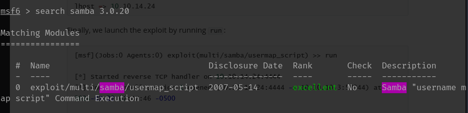

Use module and lets see the options:

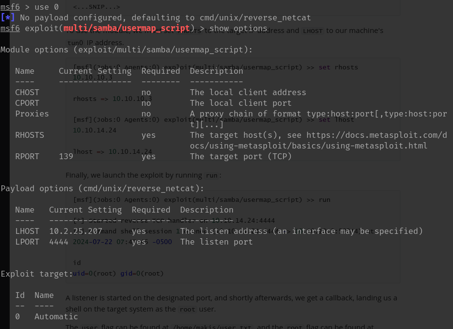

Lets set the `RHOST` to target:

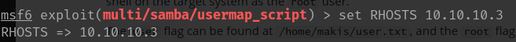

And, LHOST to our machines `tun0` Ip address. To find the tun0, use `ifconfig`:

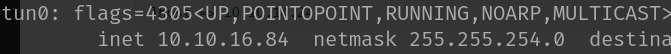

My `tuno` IP is `10.10.16.84`:

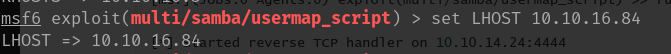

Finally, launch `run` to exploit:

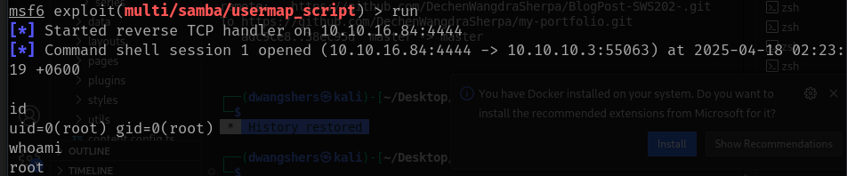

A listener is started on the designated port, and shortly afterwards, we get a callback, landing us a shell on the target system as the root user.

So, now lets find in which directory does user.txt and root.txt are in. 

To find the files, I used command which was given by chatGTP:

```
find / -name "*user.txt" 2>/dev/null
find / -name "*root.txt" 2>/dev/null
```

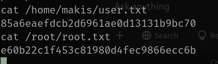

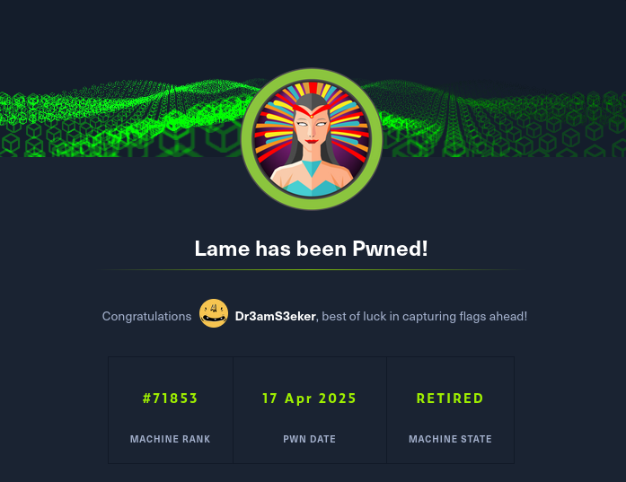

# Learnings from this Machine

- FTP Backdoor Exploitation: Learned how outdated versions of services (like VSFTPD 2.3.4) can have backdoors (CVE-2011-2523) that can be exploited via Metasploit.
- SMB Enumeration: Used smbmap and smbclient to discover and interact with Samba shares, uncovering potential vulnerabilities
- Metasploit Workflow: Gained experience using Metasploit to exploit services.

# Reference 

*Lame.pdf*. (2025). Official HTB walkthrough. Available at: Lame.pdf. SHA-256: 9923bfeffc01138dfa9efcdcd1520cf490a6ecf7c28ead8031bbc1da1521040f

Kali Linux. (n.d.). *smbmap*. Kali Tools. https://www.kali.org/tools/smbmap/

### Tools Used:

- Metasploit Modules
- smbmap
- searchsploit
- chatGPT