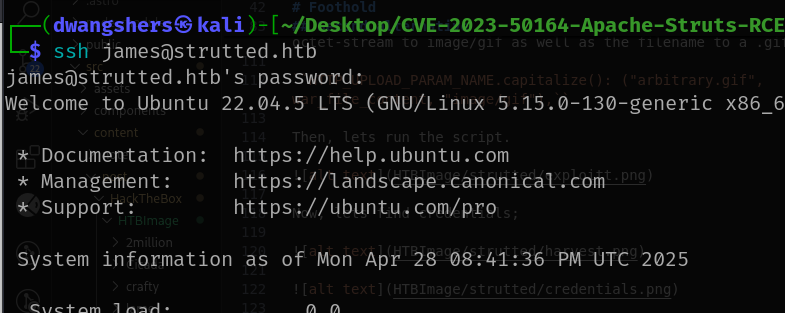

# Enumeration
## Nmap


An initial Nmap scan shows that two TCP ports are open: port 22, which is running SSH, and port 80, where a web server using Nginx is hosted. Since we don't have SSH login credentials yet, we'll start our enumeration by exploring the website on port 80. The scan also identifies a domain, strutted.htb, which we can add to our /etc/hosts file for easier access.

## HTTP

Lets visit the landing page. 


When we click on "Download," a zip file containing the Docker environment for the application is downloaded. After extracting it, we find a tomcat-users.xml file with a hardcoded plaintext password, but it turns out to be useless. Looking through the Dockerfile, we learn that the target is running Tomcat 9 along with OpenJDK 17. Further inspection of the extracted files reveals a pom.xml file, which lists all the application's dependencies.

````bash
<groupId>org.strutted.htb</groupId>
<version>1.0.0</version>
<name>Strutted™</name>
<description>Instantly upload an image and receive a unique, shareable link.
Keep your images secure, accessible, and easy to share—anywhere, anytime.
</description>
<properties>
<project.build.sourceEncoding>UTF-8</project.build.sourceEncoding>
<maven.compiler.source>17</maven.compiler.source>
<maven.compiler.target>17</maven.compiler.target>
<struts2.version>6.3.0.1</struts2.version>
<SNIP>
````

This application uses Apache Struts2 6.3.0.1. So, the package make vulnerable to remote code execution via manipulation of file upload parameters that enable path traversal.

In this scenario, the vulnerability is exploited when the web application uses a single file upload functionality, which does not directly accept arbitrary OGNL expressions as parameters for uploaded files.

# Foothold
Now that we have a better understanding of the target, we can move on to exploiting it. By analyzing the source code for upload, we see that the server only allows uploading a specific valid image file. It performs MIME type checks and has extra security measures in place to block the upload of JSP files.


The application enforces content type restrictions and also verifies the file’s magic bytes to make sure the uploaded file is truly an image. If the file passes these validation checks, it gets uploaded to the server and saved inside a timestamped folder within the uploads directory. If we try to upload any other type of file that doesn’t meet these checks, the server rejects it and displays an error.


When uploading a valid image we see the success screen which allows us to copy our shareable link:


But the button was not working for me, so I inspect the page and got the link.


``value="http://strutted.htb/s/4a9cf4d9"``

The idea behind the attack is to hide a malicious JSP file inside what looks like a normal image. After uploading it, we abuse the OGNL parameters to rename the file with a .jsp extension, making it executable on the server. To pull this off, we reuse a known JSP web shell from a previous exploit and manually insert its code just after the image's header when crafting our POST request. [Payload](https://raw.githubusercontent.com/TAM-K592/CVE-2024-53677-S2-067/refs/heads/ALOK/shell.jsp)


This is one of the text file I have made as a gif file.

After uploading it and capture the request and send it to the repeater. 


By abusing the OGNL injection, we have successfully uploaded our shell.

To get a reverse shell, we can create a custom bash.sh script and upload it to the target machine. After uploading, we need to set executable permissions on the script and then execute it to establish the shell. First, we'll prepare the shell script locally and start a Python3 web server to serve the file.


In a new terminal, run a Netcat listener.


Since, this step is not quite working. Lets go with other alternatives.

## Second alternative

The goal here is to leverage the vulnerability to upload a .war file into the Tomcat webapps directory. Since the vulnerability allows you to manipulate the file path, you can place the .war file anywhere on the server. After doing some research, you found a malicious .war file designed to exploit this specific vulnerability (CVE). Additionally, you came across an exploit script that includes this malicious .war file, which can be used to trigger the exploit when uploaded to the server.
[REPO](https://github.com/jakabakos/CVE-2023-50164-Apache-Struts-RCE)


I have cloned the repo, and I have created a python virtual environment.


Then, lets download the requirements. 


Now, the exploit script does not account for the image filters so I’ll have to make a few changes.
``vi exploit.py``

I first need to update the NUMBER_OF_PARENTS_IN_PATH variable to 5 to correctly reflect the file path structure: File/<TimeStamp>/uploads/ROOT/webapps.

Next I will add a string ``GIF89a;`` which can trick the filter into thinking that the file uploaded is gif file. 

```bash
war_file_content = open(NAME_OF_WEBSHELL_WAR, "rb").read()
war_file_content = b"GIF89a;" + war_file_content
```

Lastly, I just need to change the Content-Type from application/octet-stream to image/gif as well as the filename to a .gif file.

``HTTP_UPLOAD_PARAM_NAME.capitalize(): ("arbitrary.gif", war_file_content, "image/gif"),``

Then, lets run the script.


Now, lets find credentials;


Lets check for password reuse as the password for a admin seems to be ``IT14d6SSP81k``.

``cat /etc/passwd``


Lets try for james, as james is one of the admin.



So, I was able to log into james account.

And I was able to find the user flag.


# Privilege Escalation

When checking the sudo permissions, I noticed that the user james can run tcpdump as root without needing to enter a password. Tcpdump is a tool commonly used to capture and analyze network traffic.


I found a [GTFOBins](https://gtfobins.github.io/gtfobins/tcpdump/) entry for tcpdump that shows how it can be used for privilege escalation when it's allowed to run with sudo permissions. Using this method, we can create a script that copies /bin/bash to /tmp/bash_root, sets the setuid bit on it, and then executes it to gain root access.


When we check the /tmp directory, we can see that a copy of /bin/bash named /tmp/bash_root has been successfully created. The setuid bit is set on this file, which means we can run it with root privileges.


Now, we can execute /tmp/bash_root using the -p option, which preserves the elevated privileges and allows us to run commands as root.


So, I got the root flag as well. 


# Learning from this machine

* Service Enumeration: Using Nmap to find SSH and HTTP services.

* Web Analysis: Inspecting site files (Dockerfile, pom.xml) to find vulnerabilities.

* Exploitation:

    * OGNL injection in Apache Struts2.

    * Bypassing file upload filters (GIF header trick).

    * Uploading a malicious WAR file.

* Reverse Shell: Setting up a shell using Netcat and Python server.

* Privilege Escalation:

    * Using sudo tcpdump + GTFOBins.

    * Creating a root shell with setuid.

* Password Reuse: Finding reused credentials for privilege escalation.


# Reference:

TheCyberGeek, & 7u9y. (2025, January 12). Strutted (Document No. D25.100.317). Hack The Box.

CN-0x. (n.d.). Strutted HackTheBox Write-up. Medium. https://medium.com/@CN-0x/strutted-hackthebox-write-up-d6d1c0ed9725

jakabakos. (n.d.). CVE-2023-50164-Apache-Struts-RCE [GitHub repository]. GitHub. https://github.com/jakabakos/CVE-2023-50164-Apache-Struts-RCE

# Tools used:

Nmap — Port scanning and service enumeration

Burp Suite — Capturing and modifying HTTP requests

Python3 HTTP Server — Hosting payloads

Netcat (nc) — Reverse shell listener

TCPDump — Exploiting sudo permissions for root shell

Git — Cloning exploit repositories

Virtualenv / Pip — Setting up Python environments

Linux Commands — Basic enumeration (cat, ls, id, etc.)

Text Editor (vi) — Modifying exploit scripts